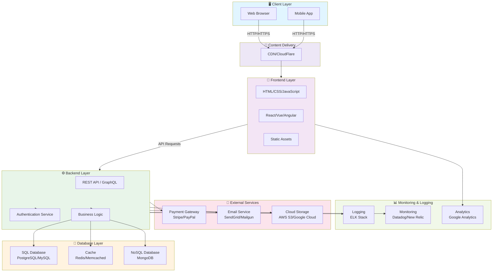

# Website Architecture Overview

## System Architecture Diagram



## Architecture Components

### 1. **Client Layer** 🖥️
- **Web Browser**: Desktop users accessing the website
- **Mobile App**: Native or progressive web app for mobile users
- **Responsibilities**: User interface, client-side rendering, local storage

### 2. **Content Delivery Network (CDN)** 📡
- **CloudFlare / AWS CloudFront**: Distributes content globally
- **Benefits**: Faster load times, reduced server load, DDoS protection
- **Caches**: Static assets (images, CSS, JavaScript, videos)

### 3. **Frontend Layer** 🎨
- **HTML/CSS/JavaScript**: Foundation of web pages
- **Frontend Framework**: React, Vue, or Angular for dynamic UIs
- **Static Assets**: Images, fonts, stylesheets, scripts
- **Responsibilities**: User interface, form validation, client-side routing

### 4. **Backend Layer** ⚙️
- **REST API / GraphQL**: Endpoints for data communication
- **Authentication Service**: User login, JWT tokens, session management
- **Business Logic**: Core application logic, data processing, validation
- **Responsibilities**: Data processing, security, business rules enforcement

### 5. **Database Layer** 💾
- **SQL Database** (PostgreSQL/MySQL): Structured relational data
  - User accounts, transactions, orders
- **Cache** (Redis/Memcached): Fast in-memory data storage
  - Session data, frequently accessed data
- **NoSQL Database** (MongoDB): Flexible document storage
  - Unstructured data, logs, flexible schemas

### 6. **External Services** 🔧
- **Payment Gateway**: Stripe, PayPal for processing payments
- **Email Service**: SendGrid, Mailgun for transactional emails
- **Cloud Storage**: AWS S3, Google Cloud for file storage
- **Responsibilities**: Specialized third-party services

### 7. **Monitoring & Logging** 📊
- **Logging**: ELK Stack (Elasticsearch, Logstash, Kibana) for error tracking
- **Monitoring**: Datadog, New Relic for performance monitoring
- **Analytics**: Google Analytics for user behavior tracking

## Data Flow

### User Request Flow:
```
1. User opens website → Browser makes HTTP request
2. CDN serves static content (images, CSS, JS)
3. Frontend loads in browser
4. User interacts → JavaScript sends API request to Backend
5. Backend receives request → Authenticates user
6. Business logic processes request → Queries Database
7. Database returns data
8. Backend sends response to Frontend
9. Frontend updates UI with new data
```

### Example: User Login
```
Browser → Backend API (/login)
         → Authentication Service verifies credentials
         → Redis Cache stores session token
         → Returns JWT token to Frontend
Browser → Frontend stores token in localStorage
         → Subsequent requests include token in headers
```

## Technology Stack Recommendations

| Layer | Technologies |
|-------|---------------|
| **Frontend** | React/Vue, TypeScript, Tailwind CSS, Webpack |
| **Backend** | Node.js/Python/Java, Express/Django/Spring, REST/GraphQL |
| **Database** | PostgreSQL, Redis, MongoDB (as needed) |
| **Hosting** | AWS/Google Cloud/Azure, Docker, Kubernetes |
| **CDN** | CloudFlare, AWS CloudFront, Akamai |
| **Monitoring** | Datadog, New Relic, ELK Stack |

## Security Considerations

✅ **HTTPS/TLS** encryption for all data in transit
✅ **Authentication** using JWT or OAuth 2.0
✅ **Authorization** role-based access control (RBAC)
✅ **Input Validation** prevent SQL injection and XSS attacks
✅ **Rate Limiting** protect API from abuse
✅ **CORS** configure cross-origin policies
✅ **Secrets Management** use environment variables for sensitive data
✅ **Database Encryption** at rest and in transit

## Scalability Strategies

📈 **Horizontal Scaling**: Add more backend servers behind load balancer
📈 **Caching**: Redis for frequently accessed data
📈 **Database Replication**: Master-slave setup for read scaling
📈 **CDN**: Distribute static content globally
📈 **Microservices**: Split backend into independent services
📈 **Message Queue**: Asynchronous processing (RabbitMQ, Kafka)

## Deployment Architecture

```
Local Development
       ↓
Git Repository (GitHub/GitLab)
       ↓
CI/CD Pipeline (GitHub Actions, Jenkins)
       ↓
Testing Environment
       ↓
Production Environment
       ↓
Monitoring & Alerts
```

---

**Created**: 2026-08-26
**Updated**: 2026-08-26
**Version**: 1.0
